# MESA CINÉTICA 🌀✨🎵

Estado y licencia  
   

Microcontrolador  


Firmware  
   

Electrónica  


App Android  
  

Diseño 3D  
  

Comunicaciones  


Componentes  
  

**MESA CINÉTICA** es un proyecto de mobiliario interactivo que integra el arte y la tecnología combinando electrónica, programación para microcontroladores, diseño e impresión 3D y desarrollo de una app Android.

Se trata de una mesa que incorpora un mecanismo de movimiento polar. Mientras el suave desplazamiento de la bola de acero sobre la arena traza patrones hipnóticos, la iluminación LED y la música acompañan cada movimiento transformando la mesa en un lienzo vivo donde arte, luz y sonido se funden.

Como el proyecto es escalable, utilizaré la versión 'mini' de lo que podría ser una mesa, principalmente porque no tengo sitio dónde ponerla 😜.

Empecé a programar hace poco más de 30 años con Visual Basic 3.0 y ya vamos por la 2026... pero este proyecto será un gran reto porque la aplicación de Android se va a desarrollar en C# con MAUI ([.NET MAUI](https://dotnet.microsoft.com/es-es/apps/maui))

Quiero agradecer a [@LaboratorioGluon](https://github.com/LaboratorioGluon) y [@STMicroelectronics ](https://github.com/STMicroelectronics)su ayuda por proporcionar la placa de desarrollo ST NUCLEO G071RB.

## 📁 Estructura del proyecto

```txt
MESA CINETICA
├── ANDROID # Aplicación para Android desarrollada en C# con MAUI (Visual Studio 2026)
├── CODIGO # Firmware desarrollado en C++ con PlatformIO en VS Code
├── ELECTRONICA # Esquemas y diseño de PCB con KiCad 10
├── FOTOS # Imagenes de las distintas fases del proyecto
├── PIEZAS # Modelos 3D (onshape) para impresión en formato STEP y 3MF
└── README.md # !! Este fichero !!
```

---

## 🧠 Descripción general

Este proyecto nace con la idea de transformar una mesa convencional en una superficie viva, donde el movimiento generado por algoritmos crea experiencias visuales únicas.

### Objetivos:

- desarrollar un sistema de control de motores paso a paso preciso y silencioso
- diseñar una PCB que integre la placa de desarrollo ST NUCLEO G071RB junto con el resto de componentes (drivers de motores, control de leds, bluetooth, reproductor MP3, amplificador, fuente alimentación...)
- modelar piezas 3D funcionales y estéticas
- crear patrones de movimiento modulables por software

Para hacer accesible el proyecto a todos los makers, los drivers de los motores, módulo bluetooth y el reproductor MP3 serán componentes independientes. En futuras versiones toda la electrónica estará en una única pcb gestionada por el microcontrolador y se utilizsará el decodificador MP3 VS1053.

---

## ⚙️ Componentes principales


| Carpeta       | Tecnología       | Descripción                                                                             |
| ------------- | ---------------- | --------------------------------------------------------------------------------------- |
| `ANDROID`     | C# MAUI          | App para gestionar el movimiento de la mesa, leds RGB, enviar diseños, reproduir MP3... |
| `CODIGO`      | C++ / PlatformIO | Lógica de movimiento, control de motores y comunicación con la aplicación de Android    |
| `ELECTRONICA` | KiCad 10         | Esquemático, diseño de PCB, gerbers...                                                  |
| `HARDWARE`    | onshape          | Piezas estructurales, soportes...                                                       |


---

## 🚀 Cómo empezar

### Prerrequisitos

- [PlatformIO](https://platformio.org/) (extensión de VS Code para compilar el código)
- [KiCad 10](https://www.kicad.org/) (para editar la pcb) o visor ([https://kicanvas.org/?repo=https://github.com/aspimaker/Mesa-cinetica/tree/main/ELECTRONICA/PCB](https://kicanvas.org/?repo=https://github.com/aspimaker/Mesa-cinetica/tree/main/ELECTRONICA/PCB))
- [onshape](https://www.freecad.org/) (para modificar las piezas impresas en 3d)
- [Visual Studio 2026 - community](https://www.freecad.org/) (para modificar la aplicación de Android)

### Clonar el repositorio

```bash
git clone https://github.com/aspimaker/mesa-cinetica.git
```

---

## ⚡Componentes


| Imagen                                                                    | Componente                                 | Modelo / tipo                                                                   | Und.                           | Función                                                                                                                                                                                                    | Precio abril 2026 |
| ------------------------------------------------------------------------- | ------------------------------------------ | ------------------------------------------------------------------------------- | ------------------------------ | ---------------------------------------------------------------------------------------------------------------------------------------------------------------------------------------------------------- | ----------------- |
| 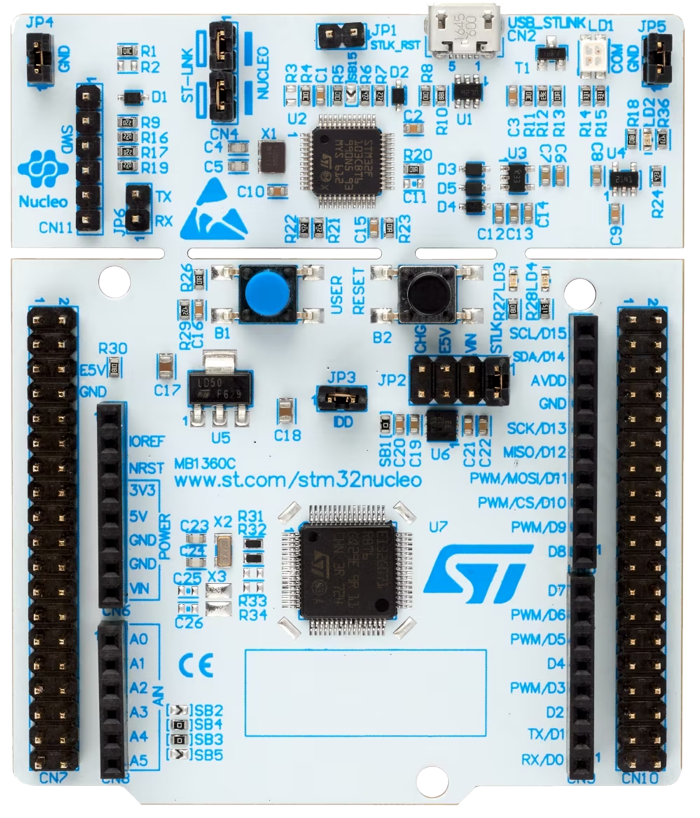             | **Microcontrolador**                       | STM32 Nucleo-G071RB                                                             | 1                              | Gestión del sistema. En esta ocasión se trata de la placa de desarrollo. Gracias a [@LaboratorioGluon](https://github.com/LaboratorioGluon) y [@STMicroelectronics](https://github.com/STMicroelectronics) |                   |
| 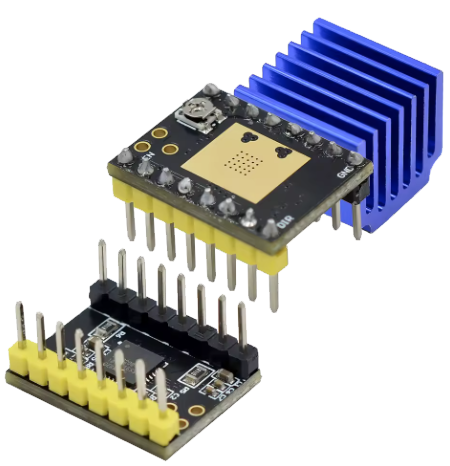                 | **Driver de motor**                        | TMC2209                                                                         | 2                              | Movimiento silencioso y suave de los ejes R y θ                                                                                                                                                            | 2.37€             |
| 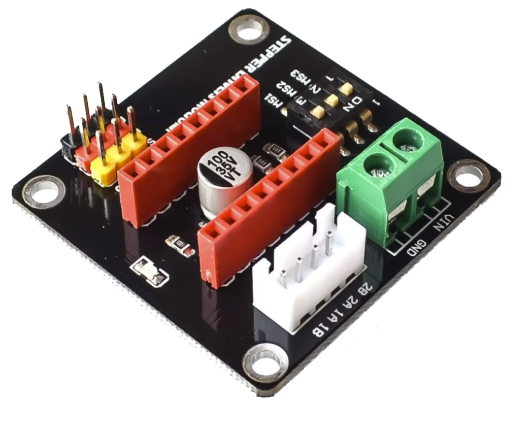                 | **Módulo para el driver**                  |                                                                                 | 2                              | Módulo para instalar el driver y conectar el motor                                                                                                                                                         | 1.09€             |
| 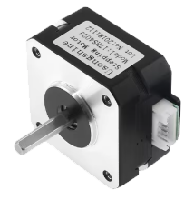                     | **Motores paso a paso**                    | NEMA17                                                                          | 2                              | Para el movimiento polar. Desplaza el imán. El tamaño dependerá del peso a mover                                                                                                                           |                   |
| 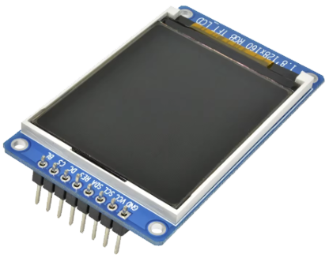             | **Pantalla**                               | ST7735S TFT 1.8" RGB SPI                                                        | 1                              | Mostrará el estado general (mp3, volumen, iluminación, modo, etc...)                                                                                                                                       | 2.81€             |
| 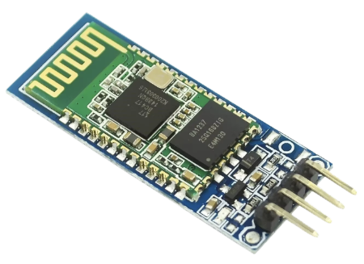                 | **Módulo bluetooth 3.0**                   | HC-05 (JDY-31)                                                                  | 1                              | Permite la comunicación con la app de Android                                                                                                                                                              | 2.25€             |
| 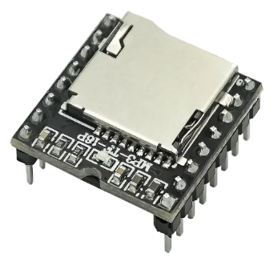               | **Reproductor de audio**                   | DFPlayer Mini MP3 V3.0                                                          | 1                              | Reproducción de música y efectos de sonido                                                                                                                                                                 | 1.29€             |
| 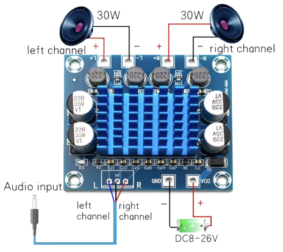                     | **Amplificador de audio**                  | TPA3110 XH-A232                                                                 | 1                              | Amplificación estéreo para altavoces                                                                                                                                                                       | 1.49€             |
| 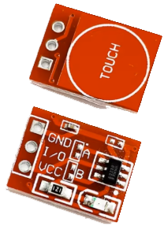               | **Pulsador táctil**                        | TTP223                                                                          |                                | Para moverse por el menú de la pantalla                                                                                                                                                                    | 0.83€ lote de 10  |
| 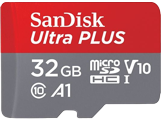                       | MicroSD / USB                              | 32Gb máximo (FAT32)                                                             | 1                              | Tendrá los ficheros mp3. También se puede utilizar un USB                                                                                                                                                  |                   |
| 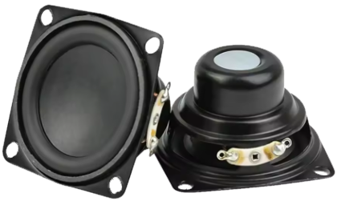                           | **Altavoces**                              | 4Ω - 8Ω, 10W-15W                                                                | 2                              | Salida de sonido estéreo                                                                                                                                                                                   | 10.79€            |
| 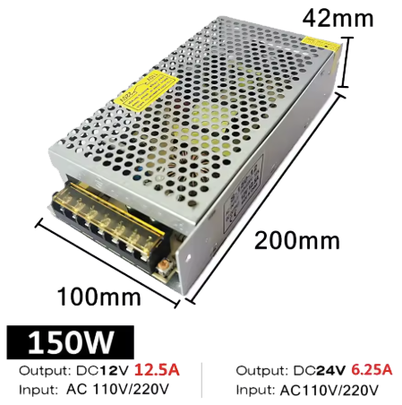 | **Fuente de alimentación**                 | 24V / 5A                                                                        | 1                              | Alimentación para motores y amplificador                                                                                                                                                                   | 8.89€             |
| 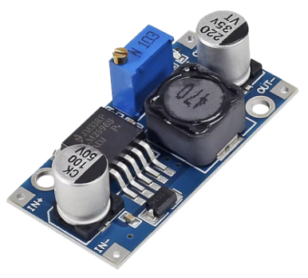                                 | **Conversor DC-DC**                        | LM2596                                                                          | 1                              | Conversión 24V → 5V para DFPlayer, leds y otros                                                                                                                                                            | 1.09€             |
| 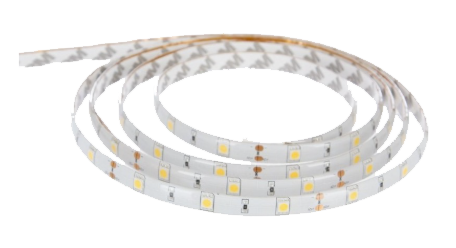             | **Iluminación LED**                        | Tira LED RGB (WS2812B)                                                          | Los necesarios según el tamaño | Efectos de luz sincronizados con movimiento y música                                                                                                                                                       | (reutilizado)     |
| 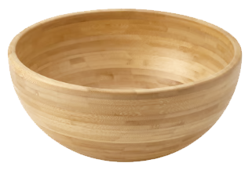             | **"Mesa"**                                 | Blanda Matt 28cm.                                                               | 1                              | Para este proyecto he utilizado la versión 'mini' de la mesa                                                                                                                                               | 14.99€            |
| 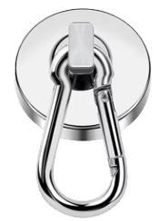                                     | **Imán**                                   | Neodimio (NdFeB)                                                                | 1                              | Dependerá de la bola de acero, grosor de la base, cantidad de arena...                                                                                                                                     | 1.99€             |
| 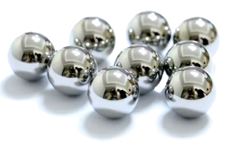                         | **Bola de acero**                          | Acero 440C. Dureza 58-60 HRC. 15mm diámetro                                     | 1                              | Es fundamental que el tipo de acero sea 440C para que sea atraída por el imán.                                                                                                                             | 1.28€             |
| 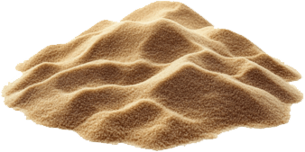                 | **Arena cinética de color beige o blanco** | 98% arena de sílice y 2% de polímero (aceite de silicona o polidimetilsiloxano) |                                | La cantidad dependerá del tamaño de la mesa. Tiene que ser de grano muy fino.                                                                                                                              |                   |


Estos componentes pueden ampliarse y cambiar en cualquier momento. Recuerda que el proyecto está en desarrollo.

---

### 🧩 Conexiones principales

- **Motores**: STM32 → TMC2209 (modo standalone con StealthChop) → NEMA17 (alimentación a 24V)
- **Audio**: STM32 → DFPlayer Mini → TPA3110 → Altavoces
- **LEDs**: STM32 → Tira WS2812B → 5V
- **Alimentación**: Fuente 24V → TMC2209, TPA3110, y LM2596 → 5V → STM32, DFPlayer y WS2812B

---

## 📄 Licencia

Este proyecto está bajo licencia **Creative Commons Atribución-NoComercial-CompartirIgual 4.0 Internacional (CC BY-NC-SA 4.0)**

Puedes:

- Compartir, copiar y redistribuir el proyecto
- Adaptar, remezclar y transformarlo

siempre que:

- **Atribuyas** el crédito al autor original (@aspimaker / MESA CINÉTICA)
- **No uses** el material con fines comerciales
- **Compartas** tus modificaciones bajo la misma licencia

[Ver texto completo de la licencia](https://creativecommons.org/licenses/by-nc-sa/4.0/deed.es)

---

## 👤 Autor

aspimaker - [@aspimaker](https://github.com/aspimaker)